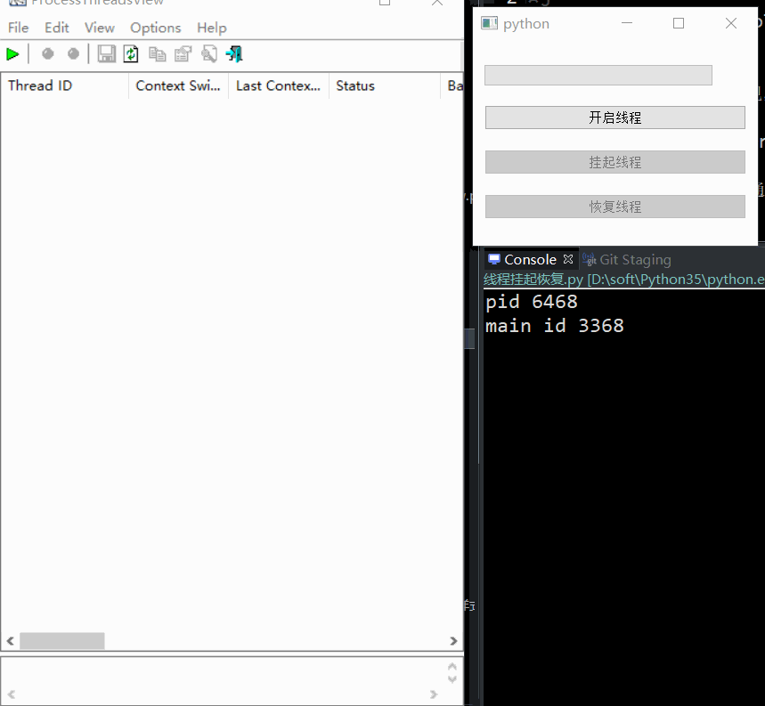

# 多线程

PyQt多线程的简单使用例子

## [1、继承QThread](继承QThread.py)

## [2、moveToThread](moveToThread.py)

## [3、线程挂起恢复](线程挂起恢复.py)

注意，这里只是简单演示，在应用这些代码时要小心

1. 这里使用windows的api实现，主要用到`SuspendThread`和`ResumeThread`函数
1. 利用`ctypes.windll.kernel32.OpenThread(win32con.PROCESS_ALL_ACCESS, False, int(QThread.currentThreadId()))`
1. 得到线程的句柄，然后就可以通过上面的两个函数对其进行挂起与恢复

`ctypes.windll.kernel32.TerminateThread`终止线程，不推荐

